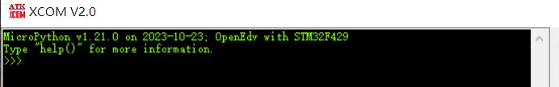

# micropython编译和应用说明

本工程包含micropython在嵌入式平台的编译和应用，基于**install-micropython/ports/unix**下应用进行编译, 支持PC-Linux, Walnutpi以及嵌入式linux开发板，增加模块pydev和pyled用于嵌入式linux应用开发。

## micropython快速应用

将编译好的包下载后，执行如下命令链接到系统目录下.

```shell
sudo ln -sf [download]/micropython /usr/bin/micropython
```

可通过如下命令快速进行micropython的应用.

```shell
micropython -v
micropython ports-unix/tests/dev_test.py
micropython ports-unix/tests/led_test.py
```

## micropython如何编程

### 下载micropython

去官网或者github下载最新的micropython代码，官网下载路径如下：<https://micropython.org/download/>.

### 解压和预编译

下载完成后解压，然后进入指定目录, 执行项目工作预编译指令。

```shell
#进入下载解压后的目录
cd [install-micropython]

#预编译
make -C mpy-cross/
```

等待编译完成，即可执行正式的编译流程。

### 添加编译工具

如果编译指定平台的micropython, 需要支持相应的编译工具，这里描述几种常见的编译工具。
arm-none-eabi-gcc: 单片机编译工具:<https://developer.arm.com/downloads/-/arm-gnu-toolchain-downloads>，选择x86_64 Linux hosted cross toolchains AArch32 bare-metal target (arm-none-eabi)版本。

arm-linux-gnueabihf-gcc:linux平台编译工具，采用指定开发板平台工具即可。

### 编译指定平台的应用

micropython支持各类单片机如stm32, cc3200, esp32平台，也支持一些系统级的平台如unix，windows，其中系统级平台如unix，我们就可以编译用于嵌入式Linux平台如Ubuntu，Debian系统的micropython应用，另外使用的配置项也有差异，下面进行详细说明。

```shell
#单片机编译命令
make BOARD=<board> -C port/<device>
  device :指定编译的芯片, 这个是port下的目录名。
  board  :指定编译的开发板硬件平台，这个是device/board下的目录名。

#编译stm32F4DISC开发板的micropython的固件
example: make -j4 V=1 BOARD=STM32F4DISC -C ports/stm32
#######################################################

#unix编译命令
make VARIANT=<variants> -C ports/unix
  variants  :指定编译的版本，在目录ports/unix/variants/下的目录名，扩展支持个人的配置项也在这里添加
```

上面对编译指令的说明, 下面对unix下目录进行扩展，支持PC，Walnutpi和imx6ull平台，执行流程如下所示。

```shell
#variants/user目录复制到ports/unix/variants/
#将port-unix下的*py文件复制到ports/unix目录下

#编译PC版本
make VARIANT=user BOARD=x86 -C ports/unix

#在Walnutpi中编译对于平台
make VARIANT=user BOARD=Walnutpi -C ports/unix
```

如果想添加自己的模块支持，只要在ports/unix下增加mod*.py文件，并添加到ports/unix/variants/user/mpconfigvariant.mk中的SRC_C中即可，下面是我自己修改的mpconfigvariant.mk的主要内容。

```shell
#增加编译的平台
BOARD ?= x86
ifeq ($(BOARD), Walnutpi)
CFLAGS += -lwiringPi -DSUPPORT_WIRINGPI_H=1
endif
ifeq ($(BOARD), imx6ull)
CROSS_COMPILE = arm-linux-gnueabihf-
endif

MICROPY_STANDALONE = 1

MICROPY_PY_FFI = 0

V = 1

#增加编译的模块
SRC_C += modpydev.c\
        modpyled.c 
```

## micropython如何实现自己的模块

在上面讲到了如何将自己实现模块添加到micropython中，这里讲下如何实现自己的模块，micropython的模块实现其实和linux驱动模块的实现有些类似，官方提供接口，使用宏即可创建用于导入的模块，这里通过例子展示如何实现自己的模块。

```c
#include <stdio.h>

#include "py/runtime.h"
#include "py/mphal.h"

STATIC mp_obj_t pytest_test(void) 
{
  printf("pytest module");
  return mp_obj_new_int(0);
}
STATIC MP_DEFINE_CONST_FUN_OBJ_0(pydev_test_obj, pytest_test);

STATIC const mp_rom_map_elem_t pytest_table[] = {  
    { MP_ROM_QSTR(MP_QSTR_val),  MP_ROM_INT(1)}
};
STATIC MP_DEFINE_CONST_DICT(pytest_table_dict, pytest_table);
//将dict封装成object，可以使用pytest.table.val访问
MP_DEFINE_CONST_OBJ_TYPE(pytest_mp_type, 
                        MP_QSTR_table, 
                        MP_TYPE_FLAG_NONE, 
                        locals_dict, &pytest_table_dict);

STATIC const mp_rom_map_elem_t pytest_module_globals_table[] = {
    { MP_ROM_QSTR(MP_QSTR___name__), MP_ROM_QSTR(MP_QSTR_pytest) },

    //导入OBJ指针，可以是函数或者对象
    //导入函数, 访问为pytest.test()
    { MP_ROM_QSTR(MP_QSTR_test), MP_ROM_PTR(&pydev_test_obj) },

    //导入为对象, 可通过pytest.table访问
    { MP_ROM_QSTR(MP_QSTR_table), MP_ROM_PTR(&pytest_mp_type) },

    //定义int类型的变量，调用方式pytest.num
    { MP_ROM_QSTR(MP_QSTR_num), MP_ROM_INT(1) },
};

STATIC MP_DEFINE_CONST_DICT(pytest_module_globals, pytest_module_globals_table);

// Define module object.
const mp_obj_module_t pytest_module = {
    .base = { &mp_type_module },
    .globals = (mp_obj_dict_t *)&pytest_module_globals,
};

// Register the module to make it available in Python.
// MP_QSTR_<module>，这里的module即为最终导入的module名
// import pytest
// 即可导入模块
MP_REGISTER_MODULE(MP_QSTR_pytest, pytest_module);
```

这里主要讲述几个特别的接口，接口的整体调用顺序为MP_QSTR_pytest->pytest_module->pytest_module_globals, 其中pytest_module_globals中定义了模块直接支持的函数.

## micropython支持功能

参考下载文档的README.md, 对于编译好的micropython支持，支持特性如下所示.

```shell
MicroPython实现了整个Python3.4语法，包含特性如下.
1.异常 'try...except'
2.'with'方法
3.'yield from'
4.'async'/'await'
5.基础数据类型提供如下
'str', 'bytes', 'bytearray', 'tuple', 
'list', 'dict', 'set', 'frozenset',
'array.array', 'collections.namedtuple'
'class and instances'
6.内建模块则包含
'os', 'sys', 'time', 're', 'struct'
'sockect', 'ssl', '_thread', 'asyncio'
另外还有特殊的模块 'micropython'
当然我也扩展了'pydev'和'pyled'模块
```

## micropyton的目录说明

这里先解析说明下micropython的文件目录说明。

- docs/ 定义micropython编译和设计的相关文档，可以基于官网编译需要的文档信息。

```shell
#编译docs前需要安装Sphinx, 具体命令如下
sudo apt-get install python3-sphinx
pip3 install -i https://pypi.mirrors.ustc.edu.cn/simple/ sphinxcontrib.jquery 
```

- drivers/ 特定的硬件驱动，用于跨多个端口工作
- **examples/**官方提供的展示micropython应用的例程，使用micropython前可参考目录下应用
- extmode/ 第三方模块文件，用于导入micropython实现具体的功能模块，如mbedtls等，在编译时使用
- lib/ 第三方库文件，包含c库，芯片库如stm32-lib，tinyusb等，在编译时使用。
- logo/ 显示logo的文件
- **mpy-cross/** 用于在编译平台上处理文件的工具，在正式编译前需要执行编译。
- **port/** 平台化信息，内部包含所有的支持平台的硬件和模块处理
- py/  python核心虚拟机处理实现
- shared/ 所有平台通用的库，组件以及助手代码，编译时调用
- tests/ 用于编译后micropython测试的脚本
- tools/ 基于python实现的用于编译micropython的工具

从上面可以看出，项目中大部分组件都是用于编译时的模块，组件。如果不是micropython的开发设计人员，不需要特殊了解，只有**example，mpy-cross，port**是使用或者编译时需要了解的目录，其中example主要提供使用的例程，在需要使用micropython时可以作为参考，这里不在赘述。mpy-cross则是预编译时使用，在编译开始前需要进行预编译。port则是个各平台对应实现的代码，如果希望将micropython移植到指定的平台，就需要在对应目录下增加相应的平台实现，如果扩展模块或者实现micropython的模块，也需要在这个目录下处理，后续进行详细的说明。

## micropython添加自己的硬件支持

micropython目前支持的硬件平台有esp32, nrf, cc3200, power-pc, stm32, unix(包含嵌入式linux)，windows等，这里包含了大部分的嵌入式类型设备，这些平台都包含在ports/目录下，以stm32为例，路径为**ports/stm32**, 这里面包含stm32需要的大部分驱动实现，对于具体的板级硬件相关信息，则定义在**ports/stm32/board**下，如我们使用的stm32f429的开发板，则可以在STM32F429DISC的基础上更改, 具体目录在:**ports/stm32/board/STM32F429DISC**中，下面讲解以下文件的说明。

- board.json, 定义板子的附加信息，可以不进行修改
- mpconfigboard.h 定义硬件相关的宏，所有时钟，I/O，外部接口的宏都在此处修改，设计与板级一致。
- mpconfigboard.mk 链接时ld中的部分参数定义，期望修改内存布局时考虑，大部分情况不用修改。
- pins.csv 包含芯片的引脚封装信息，要以实际使用的芯片引脚为准，修改比较简单，如增加PH4引脚，添加PH4, PH4即可
- stm32f4xx_hal_conf.h hal库头文件，一般不需要修改，不过HSE_VALUE值要注意和外部硬件一致，在计算时间计数需要。

在本目录下**ports_stm32_board/STM32F429/**即为修改后支持OpenEdv开发板STM32F429IGT6芯片的硬件信息，将其复制到micropython-x/ports/stm32/board目录下，执行如下脚本即可编译生成对应的micropython应用。

```shell
make -j4 V=1 BOARD=STM32F429 -C ports/stm32
```

如果编译成功，则命令行显示如下命令码。

```shell
arm-none-eabi-size build-STM32F429/firmware.elf
   text    data     bss     dec     hex filename
 311448      52   22024  333524   516d4 build-STM32F429/firmware.elf
GEN build-STM32F429/firmware0.bin
arm-none-eabi-objcopy -O binary -j .isr_vector build-STM32F429/firmware.elf build-STM32F429/firmware0.bin
GEN build-STM32F429/firmware1.bin
arm-none-eabi-objcopy -O binary -j .text -j .data -j .ARM build-STM32F429/firmware.elf build-STM32F429/firmware1.bin
GEN build-STM32F429/firmware.hex
arm-none-eabi-objcopy -O ihex build-STM32F429/firmware.elf build-STM32F429/firmware.hex
GEN build-STM32F429/firmware.dfu
python3 ../../tools/dfu.py -D 0x0483:0xDF11 -b 0x08000000:build-STM32F429/firmware0.bin -b 0x08020000:build-STM32F429/firmware1.bin build-STM32F429/firmware.dfu
```

通过下载工具如STM32CubeProgrammer将ports/stm32/build-STM32F429/firmware.hex下载到开发板中，则会执行如下所示，表示编译成功。


