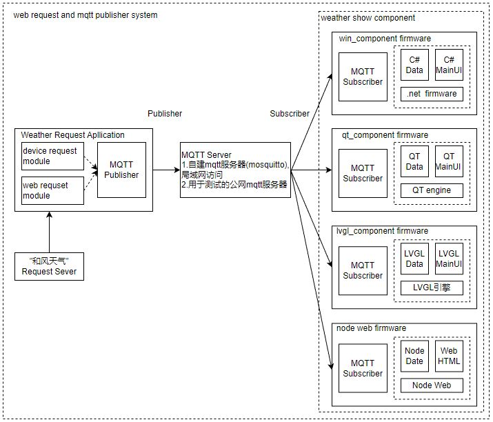

# weather管理系统组件

## 快速启动

首先需要确保系统环境下支持nodejs和npm，如果没有，可通过如下命令或者直接通过官网安装。

```shell
sudo apt install nodejs
sudo apt install npm
```

在项目启动之前，需要保证支持相应的工作环境，首先进入weather目录，执行如下命令。

```shell
#下载git文件
git clone https://github.com/zc110747/integrated_project.git

#进入weather目录
cd interageweather/weather/

#更新配置文件, 参考下节说明
#默认情况下，修改"socket"/"socket_ip"为运行平台ip地址即可使用
vim config.json.example

#将config.json.example拷贝到各目录下
#下载支持环境和库
./preRunScript.sh 

#执行启动python应用，node应用的功能
./startApp
```

## 修改配置文件config.json.example

默认使用已经下载的天气数据，如果需要从服务器下载更新天气信息，需要更新文件中的**req_weather, city和token**的参数配置。

- mqtt服务器默认使用远端的mq.tongxinmao.com服务器，如果使用本地服务器需要修改local_mqtt中的ip地址，且安装启动mosquitto服务器，mosquitto的编译可参考目录weather/weather_request/README.md中的说明。
- 默认会直接启动node服务，node服务需要修改"socket"下的socket_ip地址，用于绑定本地node服务器。

关于config.json.example参数中的配置说明如下。

```json
{
    //使用公网mqtt服务器还是本地服务器
    //如果使用本地服务器需要安装mosquitto, 并修改local_server对应本地ip和port
    //参考weather_request/README.md实现
    "use_remote":true,
    "local_mqtt":{
        "socket_ip":"192.168.16.52",
        "port":1883
    },
    "remote_mqtt":{
        "socket_ip":"mq.tongxinmao.com",
        "port":18830
    },
    "res_topic":"/public/weather/1",
    "req_topic":"/public/weather/2",

    //是否请求天气信息，true表示从和风天气请求天气，false则使用备份下的信息
    //如果设置true，需要更改city和token，详细参考和风天气的开发者文档的说明
    "req_weather":false,
    "city":"***",
    "token":"***",

    //本地平台化的信息
    //weather_show中需要用到的配置参数
    //socket_ip指定运行weather_show平台的ip
    //logger_port指定logger信息输出的端口
    //node则指定weather_show/node_component中服务器需要处理配置信息，可以不修改
    "socket":{
        "socket_ip":"192.168.16.52",
        "logger_port":15059
    },
    "node":{
        "page":"/vue-manage-device/dist/",
        "port":9093
    }
}
```

## 设计框架



整个系统大框架由两部分组成，Weather Request应用和Weather show组件框架。

- Weather Request应用主要实现通过web获取天气的信息和cpu信息，构建json信息，通过mqtt publisher提交到mqtt服务器。
- Weather Show组件框架，通过mqtt subscriber获取信息，将其推送到对应的UI界面上显示。

事实上，设计不通过mqtt服务器，直接在组件中显示组件获取数据也能实现本地显示，中间添加MQTT Server后，设计上就不只是本地设备可以通过此接口获取，其它设备如Windows PC，Linux PC, 安卓客户端，网页前端, 其它嵌入式设备都可以通过订阅获取接收的信息。

目前设计是单向推送通道，仅展示开发板的信息，如果在扩展反向的订阅通道(后期扩展中)，那么就可以接收其它客户端提交的控制信息，配合外部扩展的器件，可以实现开关灯，空调和其它设备的功能，如你所见，这就是一个基于物联网的管理方案，当然实际项目为了确保可靠和安全，还要考虑端对端的加密和校验，重发机制等问题，这就需要在项目中体现了，下面说明下方案下各目录功能。

- weather_requst/ 基于python和shell实现的下载web信息并推送到web服务器的功能
- weather_show/ 包含mqtt订阅和将数据推送到UI显示的功能
  - win_component/ 基于C#和.net实现的mqtt订阅和显示的组件 -- 已完成
  - node_web_component/ 基于node web+前端实现的mqtt订阅和显示的组件 -- 后端完成，前端开发中
  - qt_component/  基于pyqt实现的mqtt订阅和显示的组件 -- 待开发
  - lvgl_component/ 基于lvgl c++实现的mqtt订阅和显示的组件 -- 待开发
  - futter_component/ 基于futter实现的mqtt订阅和显示的组件 -- 待开发
